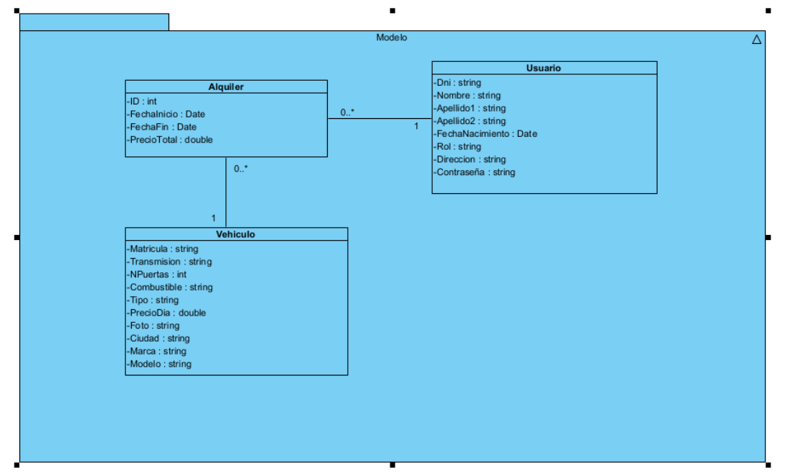

## Proyecto: Alquiler de vehiculos

Hemos decidido crear una aplicación web que está basada en el alquiler de coches,
en esta aplicación se podrá alquilar un vehículo que será seleccionado con diferentes filtros ajustados al cliente,
algunos de los filtros más importantes para la adquisición del alquiler serían:
- Tipo de vehiculo
- Modelo
- Ciudad donde necesitamos dicho vehículo
- Transmisión
- Combustible.

## Miembros del equipo de desarrollo:
- José Antonio Balboa Lechuga
- José Manuel Cueto Valero
- Manuel Cámara Serrano

## Propuesta preliminar de historias de usuario y requisitos funcionales:
**Las historias de usuario que destacamos de nuestro proyecto serían algunas como:**
- Registro y Autenticación
    - Como usuario, quiero poder registrarme en la aplicación proporcionando mi nombre, correo electrónico, teléfono y una contraseña para crear una cuenta.
    - Como usuario, quiero poder iniciar sesión con mi correo electrónico y contraseña para acceder a mis reservas.
    - Como usuario, quiero poder restablecer mi contraseña en caso de olvidarla.

- Gestión de Vehículos
    - Como administrador, quiero poder agregar, modificar y eliminar vehículos disponibles para alquiler.
    - Como usuario, quiero ver una lista de coches disponibles con detalles como marca, modelo, año, precio por día y disponibilidad.
    - Como usuario, quiero poder filtrar los vehículos por categoría, precio, marca y disponibilidad para encontrar la mejor opción.

- Pago y Facturación
    - Como usuario, quiero poder pagar mi alquiler en línea con tarjeta de crédito/débito o PayPal.
    - Como usuario, quiero recibir una factura digital después de completar el pago.

- Gestión de Reservas
    - Como usuario, quiero poder ver un historial de mis reservas y el estado de cada una.
    - Como usuario, quiero poder modificar o cancelar una reserva antes de la fecha de inicio, según las políticas de la empresa.

**Los requisitos funcionales que destacamos de nuestro proyecto serían algunos como:**
- Registro y autenticación
    - La aplicación debe permitir el registro de usuarios mediante formulario.
- Gestión de vehículos
    - Se debe ofrecer una interfaz para que el administrador gestione los vehículos. En la que cada vehículo contendrá información detallada y fotos.
- Reservas y disponibilidad
    - El sistema debe gestionar la disponibilidad de los vehículos en función de las fechas seleccionadas. No se debe permitir reservar un coche ya alquilado en el mismo período.
- Pago mediante pasarelas de pago.
    - Integración con proveedores de pago seguros como podría ser PayPal.
- Notificaciones
    - Notificaciones por correo electrónico sobre confirmación, cambios o cancelaciones de reserva.
- Panel de administración
    - Acceso para administradores con gestión de usuarios, vehículos, reservas y pagos.

## Diagrama Entidad/Relación preliminar

## Enlace para visualizar el storyboard
https://marvelapp.com/whiteboard/jjLEFgTJlwM7yEAcHgYv

## Urls de las páginas
- José Antonio Balboa Lechuga: http://34.59.26.149/
- Manuel Cámara Serrano: http://35.202.235.224/
- José Manuel Cueto Valero:http://35.238.58.208/
